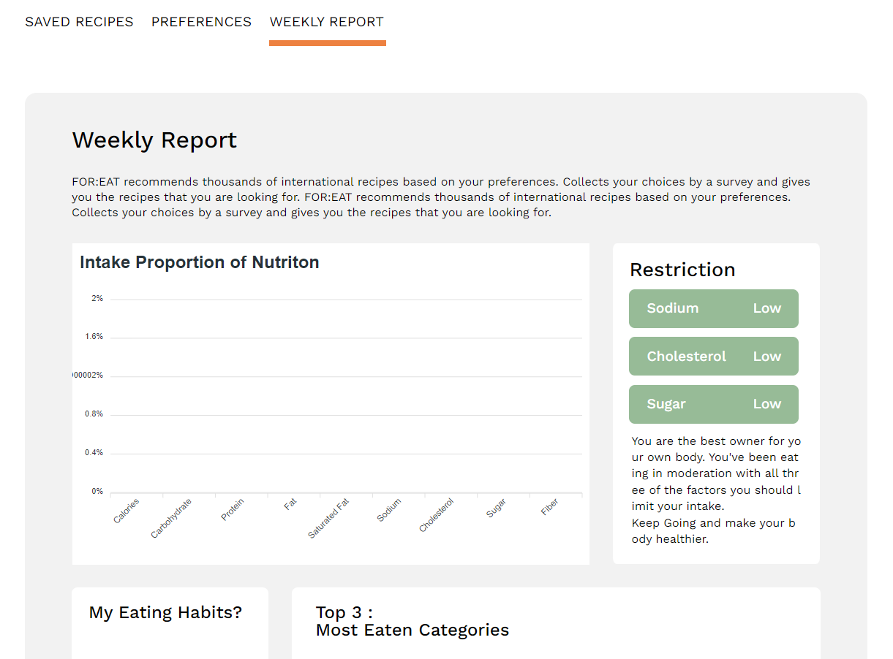

# FOR:EAT


## 목차

​	[1. FOR:EAT](#for:eat)

​	[2. 주요 기능](#주요-기능)

​	[3. Development Stack](#development-stack)

​	[4. Getting Started](#getting-started)

​	[5. Team Introduce](#team-introduce)


## FOR:EAT

**FOR:EAT**은 유저의 취향, 냉장고에 있는 재료를 반영하여 다양한 알고리즘을 통해 사용자 맞춤형으로 레시피를 추천하는 서비스입니다. 

🍴 [**사용자 맞춤 레시피 추천 서비스 FOR:EAT**](https://j6a103.p.ssafy.io/)

💡 [**Team mija u tlieta Notion**](https://www.notion.so/FOR-EAT-e294d1ecbda54887aa3d1930119d6e95)


## 주요 기능

### 사용자 맞춤형 레시피 추천


<hr/>

### 레시피 상세 정보


<hr/>

### 브라우저


<hr/>

### Weekly Report




## Development Stack

**협업**
- Jira
- Gitlab
- Notion
- Gather
- Mattermost

**Frontend**

- React
- Recoil
- Javascript
- React-router

**Backend**

- Python
- Django
- Pandas
- Scipy
- Numpy
- Scikit learn
- MySQL
- Visual Studio Code, Postman, Mysql Workbench, Sourcetree


## Getting Started

front/back 의 `.env` 파일은 sercret key 문제로 요청 시 보내드리겠습니다.

### Github Clone

- clone 받기

  ```
  git clone https://lab.ssafy.com/s06-bigdata-rec-sub2/S06P22A103.git
  ```

### Frontend

- 시스템 버전
    - node : @16.14.0
    - npm : @8.3.1
- /frontend 디렉토리로 이동
- React 모듈 설치
  
    ```
      npm install
    ```
    
- React 어플리케이션 실행
  
    ```
      npm start
    ```
    

### Backend

- 시스템 버전
    - Django: 3.2.12
    - Python: 3.9.7
    - mysql: 8.0.28
- 소스코드 pull
  
    ```
    python -m venv venv
    source venv/Scripts/activate
    pip install -r requirements.txt
    python manage.py makemigrations
    python manage.py migrate
    python manage.py loaddata recipes/fixtures/ingredient.json
    python manage.py loaddata recipes/fixtures/keyword.json
    python manage.py loaddata recipes/fixtures/allergy.json
    python manage.py loaddata recipes/fixtures/category.json
    python manage.py loaddata recipes/fixtures/recipe_final.json
    ```
    

### 배포

- 링크


## Document

- <a href="https://lab.ssafy.com/s06-bigdata-rec-sub2/S06P22A103/-/blob/develop/docs/API_%EB%AA%85%EC%84%B8%EC%84%9C.pdf">API 명세서</a>
- <a href="https://lab.ssafy.com/s06-bigdata-rec-sub2/S06P22A103/-/blob/develop/docs/ERD.PNG">ERD</a>
- <a href="https://lab.ssafy.com/s06-bigdata-rec-sub2/S06P22A103/-/blob/develop/docs/%ED%99%94%EB%A9%B4%EA%B5%AC%EC%A1%B0%EB%8F%84.pdf">화면구조도</a>
- <a href="https://lab.ssafy.com/s06-bigdata-rec-sub2/S06P22A103/-/blob/develop/docs/%EA%B8%B0%EB%8A%A5%EC%A0%95%EC%9D%98%EC%84%9C.pdf">기능 정의서</a>
- <a href="https://lab.ssafy.com/s06-bigdata-rec-sub2/S06P22A103/-/blob/develop/docs/%EC%99%80%EC%9D%B4%EC%96%B4%ED%94%84%EB%A0%88%EC%9E%84.PNG">와이어프레임</a>


## Team Introduce

|         |                김윤하                |                          김현규                          |                 서우림                 |                  이재경                  |                 장준범                  |                  한슬기                  |
| ------- | :----------------------------------: | :------------------------------------------------------: | :------------------------------------: | :--------------------------------------: | :-------------------------------------: | :--------------------------------------: |
| Profile |                                      |                                                          |                                        |                                          |                                         |                                          |
| Stack   |       팀장 & Frontend & UI/UX        | 서버 관리 및 배포 & 추천 알고리즘 분석 & 백엔드 API 개발 |  백엔드 API 개발 & 추천 알고리즘 분석  |   백엔드 API 개발 & 추천 알고리즘 분석   |            Frontend & UI/UX             |             Frontend & UI/UX             |
| Git     | [@yulloe](https://github.com/yulloe) |            [@HQkim](https://github.com/HQkim)            | [@urimseo](https://github.com/urimseo) | [@aletsire](https://github.com/aletsire) | [@UNILION](https://github.com/UNILION/) | [@1seul357](https://github.com/1seul357) |

