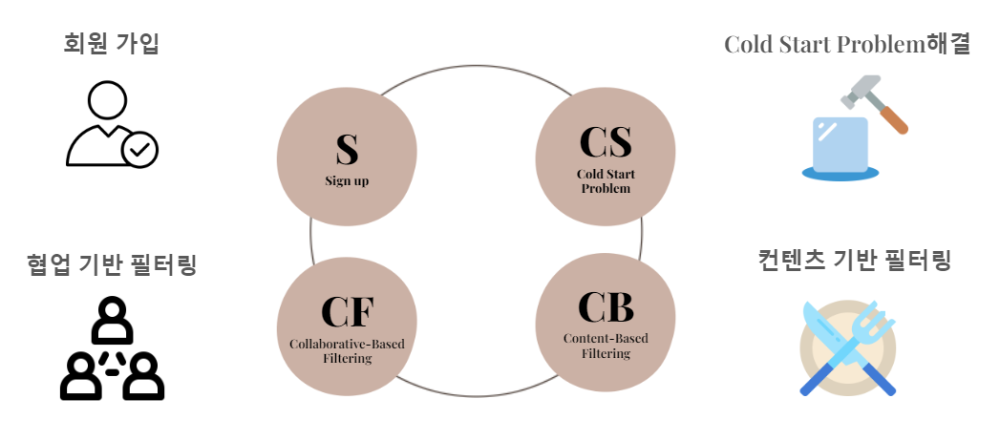
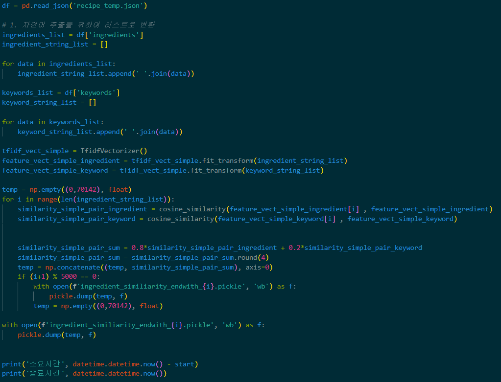
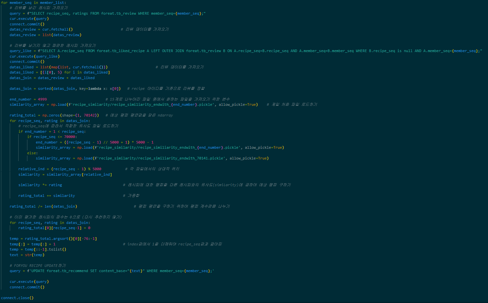
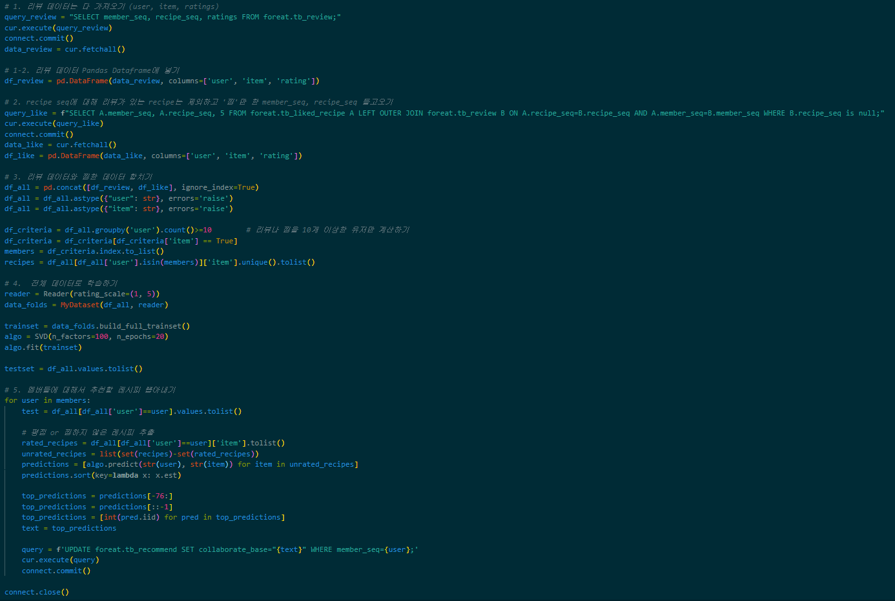

# 추천 알고리즘

- [개요](#개요)
- [Coldstart 문제해결](#ColdStart_Problem)
- [컨텐츠 기반 추천](#Contents-based_Recommendation)
- [협업 필터링](#Collaborate_Filtering)

## 개요

`FOR:EAT` 서비스는 레시피들을 추천하기 위해 아이템 컨텐츠 기반 필터링과 잠재요인 기반 필터링을 이용해 추천하기로 했습니다. 레시피 유사도 측정을 위해 레시피들을 전처리해서 분석에 용이한 형태로 가공을 해서 사용했고,  각 데이터의 형태를 기반으로 TF-IDF 방식과 유클리디안 유사도 방식을 선택해서 유사도 분석을 실행했습니다.

아이템, 유저 유사도를 측정하고 이 데이터들을 바탕으로 유저들이 남긴 평점을 적용해 컨텐츠 기반 필터링, SVD 알고리즘으로 모델을 설정하고 학습시켜 평점을 예측하고 추천하는 협업 필터링을 구현했습니다.

이 과정에서 발생하는 ColdStart Problem을 해결하기 위해서 레시피 유사도 분석만을 통한 레시피 추천, 설문조사를 통해 얻은 데이터를 이용해 유저 유사도 기반 추천 방식을 적용했습니다.

## ColdStart_Problem

컨텐츠 기반, 협업 필터링을 적용시키기 위해서는 충분한 양의 데이터가 필요합니다. 그 과정에서 서비스 초반에 적절한 추천을 해주지 못하는 ColdStart problem이 발생하게 됩니다.

신규 유저 ColdStart_Problem을 방지하기 위해 사전에 유저들이 회원가입을 하면서 받은 설문조사 데이터를 사용해서 `TF-IDF` 방식을 이용해 유저간 유사도를 측정하고 유사도가 높은 회원들이 좋은 평점을 주거나, 찜한 레시피들을 추천해 주는 방식을 적용했습니다.

또한 `TF-IDF`를 이용해 레시피 간 재료 유사도를 측정하고, `유클리디안 유사도`를 이용해 영양소 유사도를 측정해 나온 값들을 가중치를 적용해 레시피 사이의 종합 유사도를 측정했습니다.

`TF-IDF`는 단어의 발생 빈도를 고려한 수치를 제공해 주는 방법입니다. 이 과정을 거치면서 주재료/부재료의 구분을 통해 주재료의 중요도를 높여 유사도를 얻을 수 있었습니다. 이 데이터를 이용해  접근성이 높은 각각의 레시피 상세페이지에서 추천을 했습니다.

<TF_IDF>

<유클라디안>

## Contents-based_Recommendation

컨텐츠 기반 필터링은 텍스트에 기반해서 문서 유사도를 측정하여 비슷한 다른 아이템을 추천하는 방식입니다.

`FOR:EAT`서비스에서는 앞서서 측정한 레시피 유사도 데이터를 이용했습니다. 레시피 유사도 데이터에 유저가 작성한 평점, 좋아요 했던 데이터들은 평점을 5점을 준 것으로 처리하고 이 정보들을 이용해 예측 평점을 얻을 수 있었습니다. 

이후 레시피에 평점을 남기거나 좋아요한 레시피들은 평점을 0으로 바꿔주고 남아있는 레시피들을 예측 평점 순으로 정렬시켜 예측 평점이 높은 레시피 75개를 추천해주고 있습니다.

해당 알고리즘은 사용자들이 잘 이용하지 않는 시간대를 정하여 정해진 시간에 수행하도록 구현했습니다.

## Collaborate_Filtering

`FOR:EAT`서비스는 협업 필터링 중 잠재요인 기반 필터링 방법을 적용하고 있습니다. 사용자-아이템 평점 행렬 속에 숨어있는 잠재(latent)요인을 추출해 추천 예측을 하는 기법입니다.

잠재요인 분석을 위해 Surprise 라이브러리를 이용했습니다. `Surprise`란 파이썬 기반으로 `Scikit-learn API`와 비슷한 형태로 제공된 라이브러리입니다.

저희 서비스에서는 SVD 알고리즘 학습 횟수를 20회로 두고 오차범위를 줄이려고 했고, 보다 변별력이 있는 추천이 나오기 위해서 몇개의 리뷰와 좋아요 횟수가 필요한지 테스트 결과 유저가 10개의 평가를 했을 경우 협업 필터링을 통한 추천 레시피를 제공하기로 했습니다.

해당 알고리즘은 사용자들이 잘 이용하지 않는 시간대를 정하여 정해진 시간에 수행하도록 구현했습니다.

